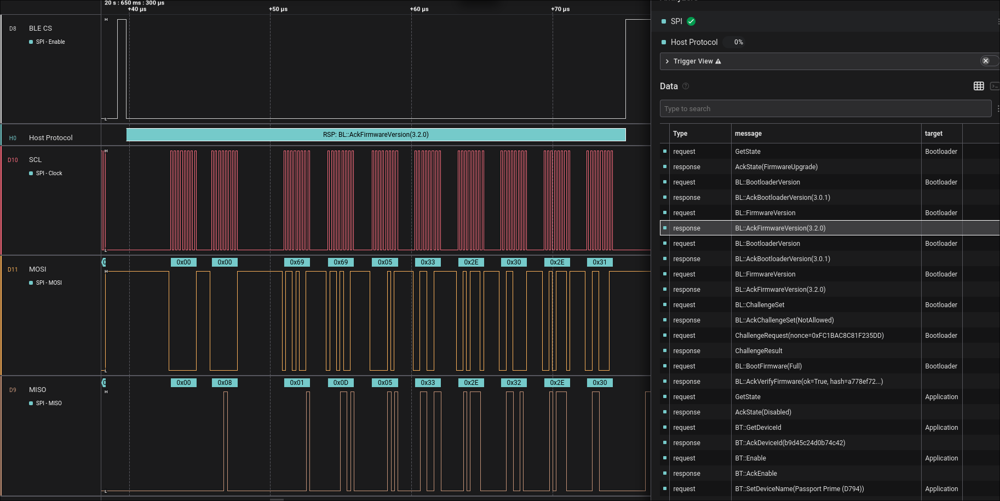

# Host Protocol HLA for Saleae Logic 2

A High Level Analyzer extension for [Saleae Logic 2](https://www.saleae.com/pages/downloads) that decodes
`host-protocol` messages exchanged over SPI between the host MPU and the nRF52805 BLE controller.

Messages are postcard-encoded. The HLA decodes all `HostProtocolMessage` variants
(Bluetooth, Bootloader, Reset, GetState, ChallengeRequest, etc.) and displays
human-readable names with key payload fields.

## Installation

1. Open **Saleae Logic 2**
2. Click the **Extensions** button (puzzle piece icon) in the sidebar
3. Click the **three-dot menu** (top-right of the Extensions panel) and select **Install Extension from Disk...**
4. Navigate to this directory (`host-protocol/saleae-hla/`) and select it
5. The extension is now available as **Host Protocol** in the analyzers list

## Usage

1. Add an **SPI** analyzer to your capture (configure MOSI, MISO, CLK, and CS lines)
2. Click **Add Analyzer** again and select **Host Protocol**
3. Set the SPI analyzer as its input
4. Decoded messages appear as overlay bubbles on the waveform:
   - `REQ: <message>` for requests (host to target)
   - `RSP: <message>` for responses (target to host)
   - `ERR: 
` for undecoded transactions

The **target** column in the data table shows which firmware is active on the nRF52805
(`Application` or `Bootloader`), detected from the first MISO byte during request transactions.

## SPI Transaction Flow

- **Request transaction**: MOSI carries the raw postcard-encoded message, MISO returns the target identifier byte (`0x51` = Application, `0x69` = Bootloader)
- **Response transaction**: MISO carries a 2-byte big-endian length prefix followed by the postcard-encoded response
- Idle polling transactions (all zeros) are silently ignored
